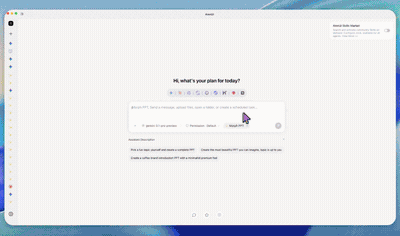
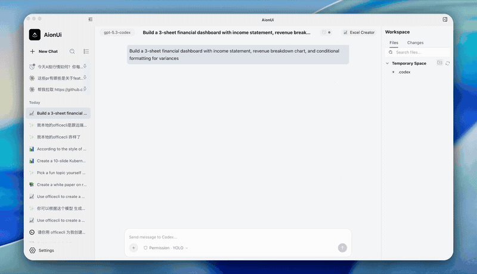
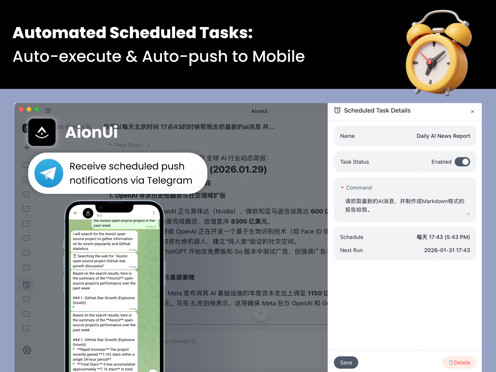

<p align="center">
  
</p>

<p align="center">
  
  &nbsp;
  
  &nbsp;
  
</p>

<p align="center">
  <a href="https://trendshift.io/repositories/15423" target="_blank">
    
  </a>
</p>

---

<p align="center">
  <strong>Free, Open-Source Cowork App for side-by-side collaboration with AI Agents</strong><br>
  <em>Built-in Agents | Zero-Config | Any API Key | Multi-Agent Support | Remote Access | Cross-Platform | 24/7 Automation</em>
</p>

<p align="center">
  <a href="https://github.com/iOfficeAI/AURA/releases">
    
  </a>
</p>

<p align="center">
  <strong>English</strong> | <a href="docs/readme/readme_ch.md">简体中文</a> | <a href="docs/readme/readme_tw.md">繁體中文</a> | <a href="docs/readme/readme_jp.md">日本語</a> | <a href="docs/readme/readme_ko.md">한국어</a> | <a href="docs/readme/readme_es.md">Español</a> | <a href="docs/readme/readme_pt.md">Português</a> | <a href="docs/readme/readme_tr.md">Türkçe</a> | <a href="docs/readme/readme_ru.md">Русский</a> | <a href="docs/readme/readme_uk.md">Українська</a>
</p>

<p align="center">
  <strong>💬 Community:</strong> <a href="https://discord.gg/2QAwJn7Egx" target="_blank">Discord (English)</a> | <a href="resources/wx-14.png" target="_blank">WeChat (Chinese Group)</a> | <a href="https://twitter.com/AURAUI" target="_blank">Twitter</a>
</p>

---

## 📋 Table of Contents

- [⚡ Cowork - Side-by-Side with AI Agents](#-cowork---side-by-side-with-ai-agents)
- [📁 ChatGPT-Style Projects (New!)](#-chatgpt-style-projects-new)
- [🤖 Multi-Agent Ecosystem](#-multi-agent-ecosystem)
- [👥 Team Mode - Multi-Agent Orchestration](#-team-mode---multi-agent-orchestration)
- [📄 Built-in Professional Assistants](#-built-in-professional-assistants)
- [🔑 Multiple LLM Providers](#-multiple-llm-providers)
- [⏰ natural-language Cron Automation](#-natural-language-cron-automation)
- [📱 Anywhere Access (WebUI + Bots)](#-anywhere-access-webui--bots)
- [🚀 Quick Start](#-quick-start)

---

## ⚡ Cowork - Side-by-Side with AI Agents

**AURA is not just another chatbot client.** It is a complete **Cowork** platform. AURA gives AI Agents full capabilities to run tasks autonomously on your machine (reading/writing files, running terminal commands, searching the web, executing MCP tools)—all under your explicit, step-by-step supervision.

| Feature | Traditional AI Chats | **AURA (Cowork)** |
| :--- | :--- | :--- |
| **File Operations** | Read-only / Limited | **Yes - Full read/write with active workspaces** |
| **Autonomous execution** | No | **Yes - Multi-step agent execution with permission gates** |
| **Projects & Context** | General timeline | **Yes - Scoped settings, files, memory, and prompts** |
| **Scheduled Automation** | No | **Yes - Natural-language Cron scheduler** |
| **Multi-Agent Orchestration** | No | **Yes - Team Mode (Leader/Teammate pattern)** |
| **Remote Access** | None | **Yes - WebUI + Telegram / Lark / DingTalk / WeChat** |
| **Local-first / Privacy** | Cloud | **Yes - SQLite local database, cloud-sync ready** |

---

## 📁 ChatGPT-Style Projects (New!)

Organize your conversations, files, custom memory, and LLM preferences into isolated **Projects**. 

<p align="center">
  
</p>

- **Isolated Scopes**: Settings, instructions, memory, and uploaded files are restricted per project. Memory never leaks between scopes.
- **Dynamic Configuration Inheritance**: All conversations created in a project automatically inherit project instructions, voice defaults, preferred models, temperature, and enabled MCP servers/agents.
- **File Management**: Drag-and-drop file uploads, search, and delete support scoped to your working directories.
- **Persistent Context**: Stores and restores your last active project. Fallback protection automatically points missing entities to the built-in "General" project.
- **Stable UUIDs**: Fully prepared for future offline backup, import/export, and cloud synchronization.

---

## 🤖 Multi-Agent Ecosystem

AURA automatically detects existing command-line developer tools on your system and wraps them in a beautiful, unified workspace GUI.

**Supported Agents**: Built-in Agent (Zero-Config) • Claude Code • Codex • Qwen Code • Goose AI • OpenClaw • Augment Code • CodeBuddy • Kimi CLI • OpenCode • Factory Droid • GitHub Copilot • Qoder CLI • Mistral Vibe • Nanobot • AURA CLI (aionrs) • Snow CLI • Hermes Agent • Cursor Agent and more.

- **Unified Control**: Configure MCP (Model Context Protocol) servers once and inject them across all developer agents.
- **YOLO Mode**: Easily toggle auto-approval modes to let developer agents run tasks completely unattended.

---

## 👥 Team Mode - Multi-Agent Orchestration

Define teams of agents to solve complex workflows. A **Leader** agent processes instructions, divides them into parallel sub-tasks, and delegates them to **Teammate** agents.

<p align="center">
  
</p>

- **Shared Workspaces**: All team agents work synchronously inside the same local project workspace folder.
- **Asynchronous Communication**: Teammates update progress boards and exchange context via asynchronous mailboxes.
- **Permission Supervision**: Monitor active runs with separate, granular permission sliders for each teammate.

---

## 📄 Built-in Professional Assistants

Powered by **[OfficeCLI](https://github.com/iOfficeAI/OfficeCLI)**, AURA includes **21 pre-configured professional assistants** to automate document formatting, layout, and calculations:

- **Morph PPT**: Generates presentation slide decks (`.pptx`) with seamless Morph transitions.
- **Structured Word**: Generates production-ready academic papers, contracts, and templates (`.docx`).
- **Excel Automator**: Generates sheets (`.xlsx/.xlsm`) with automated styling, calculations, and formulas.

<table>
  <tr>
    <td align="center" width="33%">
      <br>
      <strong>Morph PPT</strong>
    </td>
    <td align="center" width="33%">
      <br>
      <strong>Word Generation</strong>
    </td>
    <td align="center" width="33%">
      <br>
      <strong>Excel Automator</strong>
    </td>
  </tr>
</table>

---

## 🔑 Multiple LLM Providers

Bring your own key! AURA supports cloud-based services, local nodes, and custom API gateways:

- **Commercial Clouds**: OpenAI, Anthropic, Gemini, DeepSeek, OpenRouter, xAI.
- **Local Services**: Ollama, LM Studio (via customizable endpoints).
- **China Platforms**: Dashscope (Qwen), Zhipu, Moonshot (Kimi), Baidu, Tencent.
- **Unified Gateways**: Full support for [NewAPI](https://github.com/QuantumNous/new-api) servers.

---

## ⏰ natural-language Cron Automation

Set schedules for repetitive tasks using natural language. AURA wakes up, launches agents, runs commands, and publishes updates on a recurring basis.

- **Flexible Schedules**: Cron expressions, intervals (every N minutes/hours), or one-time alerts.
- **Persistence & Wakeup**: Automatically prevents OS sleep modes and queues missed jobs if the device was asleep.

<p align="center">
  
</p>

---

## 📱 Anywhere Access (WebUI + Bots)

Take your local workspace workspace tools on the go! Connect to AURA remotely via:

- **WebUI**: Fully responsive web interface with scanning QR codes or password authentication.
- **Chat Bots**: Native messaging interfaces via Telegram, Lark, DingTalk, and WeChat.

<p align="center">
  
</p>

---

## 🚀 Quick Start

### Prerequisites
Make sure you have [Bun](https://bun.sh) installed.

### Development
1. Clone the repository and install dependencies:
   ```bash
   git clone https://github.com/iOfficeAI/AURA.git
   cd AURA
   bun install
   ```

2. Start the development server:
   ```bash
   bun run dev
   ```

### Running Tests
Execute unit and integration tests via Vitest:
```bash
bun run test
```

### Build & Package
Build the production package:
```bash
bun run build
```
